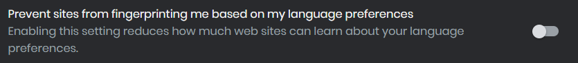

# select-gpt

A chrome extension that lets you select any text and run it through ChatGPT discretly

## Usage

- On any webpage, select the text to be run through ChatGPT.
- Ctrl + I to send query to ChatGPT, the response will be cpied to clipboard(PS: use Ctrl+F to view).


## Installation

- Download the [zipped source code](https://github.com/mihiraggarwal/select-gpt/archive/refs/heads/main.zip) and unzip it.

  Or download the code using

  ```
  git clone https://github.com/mihiraggarwal/select-gpt.git
  ```

- Go to `service-worker.js` and set your `OPENAI_API_KEY`.
- Modify the request `content` to fit the subject you are taking the exam for.
- Go to the extensions page for your browser. For Chrome, go to `chrome://extensions/`.
- Turn on developer mode by toggling it on the top right.
- Click on Load Unpacked and navigate to the folder downloaded from GitHub.
  
The extension will now be visible in the extensions panel in the toolbar; it can be pinned and used from there.

> After installing the extension, you will need to close and reopen the browser for the very first use.

## Troubleshooting

- Using the extension requires having created an account on [ChatGPT](https://chat.openai.com). Once in a while, the extension will redirect to that page to pass the cloudflare check.
- If you are using brave browser, be sure to uncheck "Prevent sites from fingerprinting me based on my language preferences" in `brave://settings/shields`
  
  

- Since the extension gets the response as a readable stream, it shouldn't take too long to load. If it does so, simply close the popup and run it again.

## References

- <https://github.com/wong2/chat-gpt-google-extension>
